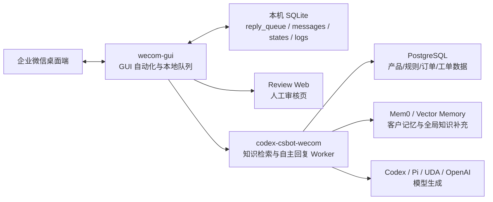
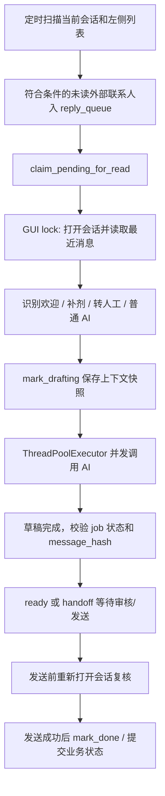
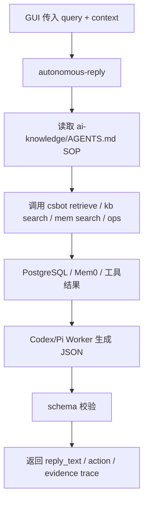

# 项目架构与流程总览

本文从顶层模块一路拆到服务内部模块，帮助快速掌握当前企微自动客服项目的运行链路、上下文传入方式、`external_user_id` 的作用，以及多用户回复时的并发与保护机制。

## 1. 顶层架构

项目是一个基于 macOS 企微桌面端的客服辅助系统，不走官方收发消息 API。系统通过 Accessibility 读取企微窗口、点击会话、读取聊天记录、生成回复草稿，并在审核或自动模式下粘贴发送。



顶层可分为两个主服务：

1. `wecom-gui`：负责企微 GUI 自动化、本机任务队列、读取聊天、上下文快照、草稿入队、审核页、发送前复核和发送。
2. `codex-csbot-wecom`：负责知识库同步、PostgreSQL 检索、Mem0 召回、订单/物流等工具，以及 Codex/Pi 自主回复 Worker。

## 2. 代码目录职责

```text
wecom-auto-serverSupport/
├── wecom-gui/
│   ├── scripts/wecom-agent                      # 启停脚本，加载 .env.local
│   └── cli_anything/wecom_gui/
│       ├── wecom_gui_cli.py                     # CLI 入口
│       ├── core/
│       │   ├── agent.py                         # 主 Agent 循环、路由、并发、发送
│       │   ├── state.py                         # SQLite 状态、队列、锁、日志
│       │   ├── worker.py                        # 左侧会话扫描与入队
│       │   ├── inbox.py                         # 打开企微左侧会话
│       │   ├── chat.py                          # 读取当前聊天窗口
│       │   ├── llm.py                           # 上下文构造与模型调用
│       │   ├── reply.py                         # 输入框粘贴与发送
│       │   ├── review_server.py                 # 审核页 API
│       │   ├── welcome.py                       # 新用户欢迎流程判断
│       │   ├── agent_input.py                   # 单独导出当前企微窗口给 Agent 的输入
│       │   └── sidebar_server.py                # 企微侧边栏 external_userid 绑定
│       └── utils/macos_backend.py               # AppleScript/Swift AX 后端封装
├── codex-csbot-wecom/
│   └── csbot/
│       ├── autonomous_worker.py                 # Codex/Pi 自主回复 Worker
│       ├── db.py                                # 本地/PG 数据访问与 schema
│       ├── feishu_sync.py / weiban_sync.py      # 外部知识源同步
│       ├── retrieve.py                          # 知识检索入口
│       ├── mem0_client.py                       # Mem0 记忆访问
│       └── debug_server.py                      # 调试 UI 服务
├── ai-knowledge/AGENTS.md                       # 自主 Worker SOP
├── docs/                                        # 架构、流程和任务文档
└── deploy/                                      # 部署共享配置
```

## 3. wecom-gui 服务内部模块

### 3.1 启动脚本与本机配置

`wecom-gui/scripts/wecom-agent` 是生产常用入口。它会读取 `wecom-gui/.env.local`，再启动 `python -m cli_anything.wecom_gui agent`。

当前本机 AI 并发配置为：

```env
WECOM_AGENT_MAX_DRAFTS=20
WECOM_AGENT_TEXT_WORKERS=15
WECOM_AGENT_IMAGE_WORKERS=5
```

含义：

- `WECOM_AGENT_MAX_DRAFTS=20`：AI 草稿总并发最多 20 个。
- `WECOM_AGENT_TEXT_WORKERS=15`：文字消息草稿池最多 15 个。
- `WECOM_AGENT_IMAGE_WORKERS=5`：带图片的最新客户轮次最多 5 个。
- GUI 读取、点击、发送不受这三个值并行化，仍由 `state.gui_lock()` 串行保护。

### 3.2 主循环

`core/agent.py` 的 `agent_loop()` 是主循环。核心流程：



关键点：

- 扫描和读取通过 `worker.py`、`inbox.py`、`chat.py` 完成。
- 任何 GUI 操作都包在 `state.gui_lock()` 里，避免多个进程或线程同时点击企微。
- AI 草稿在 GUI lock 外执行，所以可以并发。
- 发送前会重新打开会话读取最新消息，确保回复没有过期。

### 3.3 本地 SQLite 状态

`core/state.py` 管理本机 SQLite，路径为：

```text
~/.cli-anything-wecom-gui/state.sqlite
```

主要表和用途：

| 表/状态 | 用途 |
| --- | --- |
| `reply_queue` | 每个待处理会话的队列状态、草稿、上下文、reply_source |
| `conversation_messages` | 已读取的聊天消息、角色、图片 media 信息 |
| `welcome_states` | 新用户欢迎状态：pending/sent/skipped |
| `supplement_states` | 补剂 Agent 阶段、挖需次数、客户画像摘要 |
| `supplement_agent_logs` | 补剂 Agent 各阶段结构化日志 |
| `metrics` / `events.jsonl` | 运行审计和指标 |

队列状态主链路：

```text
pending -> reading -> drafting -> ready -> approved -> sending -> done
                                      \-> skipped / failed
```

## 4. 上下文如何传给 Agent

当前上下文有两条路径：本地队列上下文和模型输入上下文。

### 4.1 本地队列上下文

读取聊天后，`agent.py` 调用 `state.mark_drafting()` 写入 `reply_queue.context_json`。主要内容包括：

- `latest`：本次回复所针对的最新客户消息。
- `message_count`：本轮读取到的消息数。
- 普通 AI：只保存基础上下文。
- 补剂 Agent：额外保存 `agent_mode=supplement`、`agent_context`、`supplement_trace_id`、`supplement_customer_key`。

这个上下文用于：

- 审核页展示。
- 发送前复核时取 `expected_latest_text`。
- 草稿完成后判断是否仍对应同一条消息。
- 补剂/欢迎等业务状态提交。

### 4.2 模型输入上下文

`core/llm.py` 的 `build_csbot_context()` 会把企微消息压缩成给 `codex-csbot-wecom` 的 JSON：

```json
{
  "source": "wecom-gui",
  "messages": [
    {"role": "用户", "text": "客户消息"},
    {"role": "客服", "text": "客服消息"}
  ],
  "known_facts": {},
  "agent_mode": "supplement",
  "agent_context": {},
  "image_paths": ["/path/to/captured-image.png"],
  "customer_name": "客户昵称",
  "conversation_title": "客户昵称"
}
```

然后 `draft_reply_codex_csbot()` 会以 `--context-json` 传给：

```bash
python -m csbot autonomous-reply
```

带图片时，最新客户轮次中的图片路径会进入 `image_paths`；Pi Worker 支持把这些图片作为 CLI 附件传入图片模型。

### 4.3 单独测试读取内容

`core/agent_input.py` 用于只读取当前企微窗口并导出给 Agent 的输入，不影响正常队列和发送。它会输出：

- `read.messages`：GUI 实际读取到的消息。
- `agent_input.messages`：传给本地 Agent 的消息数组。
- `csbot_input.query`：最新客户轮次文本。
- `csbot_input.context`：传给 CSBot Worker 的上下文。

## 5. external_user_id 与会话上下文

`external_user_id` 是企微外部联系人的稳定客户 ID，不是消息 ID。

当前行为：

- 左侧会话扫描时通常只能拿到标题、标签、未读预览、点击位置，不能稳定拿到 `external_user_id`。
- 打开具体会话后，如果企微侧边栏或调试接口暴露当前外部联系人信息，`macos_backend.current_external_user_id()` 可以读取到 UID。
- `sidebar_server.py` 也支持通过企微 JS-SDK `getCurExternalContact` 绑定当前客户 UID。
- 一旦拿到 UID，会调用 `state.upgrade_job_conversation_key_to_uid()` 将队列 key 从 `visible:*` 升级为 `uid:{external_user_id}`。

会话隔离优先级：

```text
uid:{external_user_id} -> conversation/external id -> visible:{hash(title,tags,source,slot)} -> legacy title key
```

结论：

- `external_user_id` 是维护客户长期上下文的最佳 ID。
- 抓取左侧列表时不保证可获得。
- 打开会话后可尝试获得并升级队列 key。
- 未绑定 UID 时，会用 `conversation_key` 兜底，避免多个新用户共享状态。

## 6. 多用户回复是单线程还是多线程

整体是“GUI 串行 + AI 多线程”的混合模型。

```mermaid
sequenceDiagram
  participant Loop as Agent Loop
  participant GUI as GUI Lock
  participant DB as SQLite Queue
  participant Pool as AI ThreadPool
  participant Send as Send Recheck

  Loop->>GUI: 串行打开会话并读取
  GUI->>DB: 保存消息快照和 message_hash
  Loop->>Pool: 提交 AI 草稿任务
  Pool-->>Loop: 多个草稿并发完成
  Loop->>DB: mark_ready
  Loop->>GUI: 串行重新打开会话复核
  GUI->>Send: 粘贴并发送
  Send->>DB: mark_done
```

当前本机配置：

- AI 总线程数：20。
- 文字回复池：15。
- 图片回复池：5。
- GUI 读取/点击/发送：单通道串行。
- SQLite claim/mark 状态：原子化更新，避免同一个 job 被重复消费。

## 7. 上下文保护机制

当前系统有多层保护：

1. GUI 锁：`state.gui_lock()` 串行所有企微窗口操作。
2. 队列 claim：pending/approved 等状态通过 SQLite claim 转换，避免重复处理。
3. `conversation_key`：按客户或可见会话位置隔离队列。
4. `last_message_hash`：读取时记录当前聊天消息 hash。
5. `_DRAFT_MESSAGE_HASH`：AI 草稿完成后校验 job 仍处于 `drafting`，且 hash 没被新消息覆盖。
6. 发送前复核：重新打开会话读取最新客户消息，与草稿对应的 `expected_latest_text` 比对。
7. stale 跳过：若客户在发送前又发了新消息，旧草稿标记 `skipped`，不会发送。
8. 发送后验证：发送后再次读取会话，确认回复文本可见后才 `mark_done`。
9. 欢迎/补剂状态延迟提交：只有发送成功后才提交 `welcome_sent` 或补剂推荐完成态。

## 8. 业务 Agent 分流

### 8.1 新用户欢迎流程

识别企微系统文案：

```text
你已添加了 {客户昵称}，现在可以开始聊天了。
```

若该客户未记录欢迎状态，则生成固定欢迎话术草稿，标记：

```text
reply_source=welcome
```

欢迎话术仍进入队列，支持 `dry-run/review/auto`。发送前若客户又发新消息导致上下文变化，不提前写入 `welcome_sent`。

### 8.2 补剂推荐 Agent

补剂推荐独立于普通 AI 客服，草稿统一标记：

```text
reply_source=supplement
```

阶段：

```text
collecting_profile -> digging_need -> ready_to_recommend -> recommended -> closed/skipped
```

数据主源设计为 SQL 中的：

- `10 补剂推荐`
- `5 产品常规信息`
- `7 L0级注意事项`

Mem0 只做客户记忆补充，不覆盖产品事实和合规规则。

### 8.3 转人工

用户显式要求“人工/转人工/人工客服”时，进入 handoff 状态。AI 判断无法安全回答时也可返回 handoff。转人工会话收到新客户消息后保持人工接管提示，不自动抢答。

## 9. codex-csbot-wecom 内部流程

`codex-csbot-wecom` 是知识与生成服务。它的原则是“事实来自结构化检索，模型负责组织表达”。



核心模块：

- `autonomous_worker.py`：构造 Worker prompt、启动 Codex/Pi、解析 JSON。
- `retrieve.py`：知识检索入口，面向产品事实、FAQ、规则。
- `db.py`：数据库连接和表结构管理。
- `mem0_client.py`：客户记忆和全局向量知识召回。
- `debug_server.py`：调试页面，可测试固定双召回和自主检索。

## 10. 当前风险点与建议

1. `external_user_id` 不一定在扫描阶段可用，生产建议尽量启用侧边栏绑定，让长期上下文稳定落在 `uid:{external_user_id}`。
2. 如果 AX 角色识别把客服回复误判为 `用户`，`latest_user_turn_text()` 可能把过多历史当成客户最新轮次，需要持续用只读导出文件校准。
3. AI 并发提升到 20 后，模型服务、网络和审核页吞吐要一起观察；GUI 发送仍是串行瓶颈。
4. 欢迎、补剂、普通 AI 都共用同一队列，必须依赖 `reply_source` 和业务状态表区分审计。
5. 自动发送前应优先使用 `review` 模式跑稳定，再逐步开放 `auto`。

## 11. 快速定位清单

| 问题 | 优先查看 |
| --- | --- |
| 为什么没扫到会话 | `worker.py`、`inbox.py`、运行日志里的左侧扫描统计 |
| 为什么读不到新增内容 | `chat.py`、`macos_backend.py`、`agent_input.py` 导出结果 |
| 为什么没有触发补剂 | `agent.py` 的 `_supplement_route()`、`supplement_states` |
| 为什么草稿被跳过 | `reply_queue.last_message_hash`、`agent_stale_draft_discarded`、`agent_stale` |
| 为什么未绑定 UID | `macos_backend.current_external_user_id()`、`sidebar_server.py` |
| AI 并发是多少 | `wecom-gui/.env.local`、启动日志“最多并发AI/文本池/图片池” |
| 最终发了什么 | `reply_queue.reply_text`、`conversation_messages`、`events.jsonl` |
